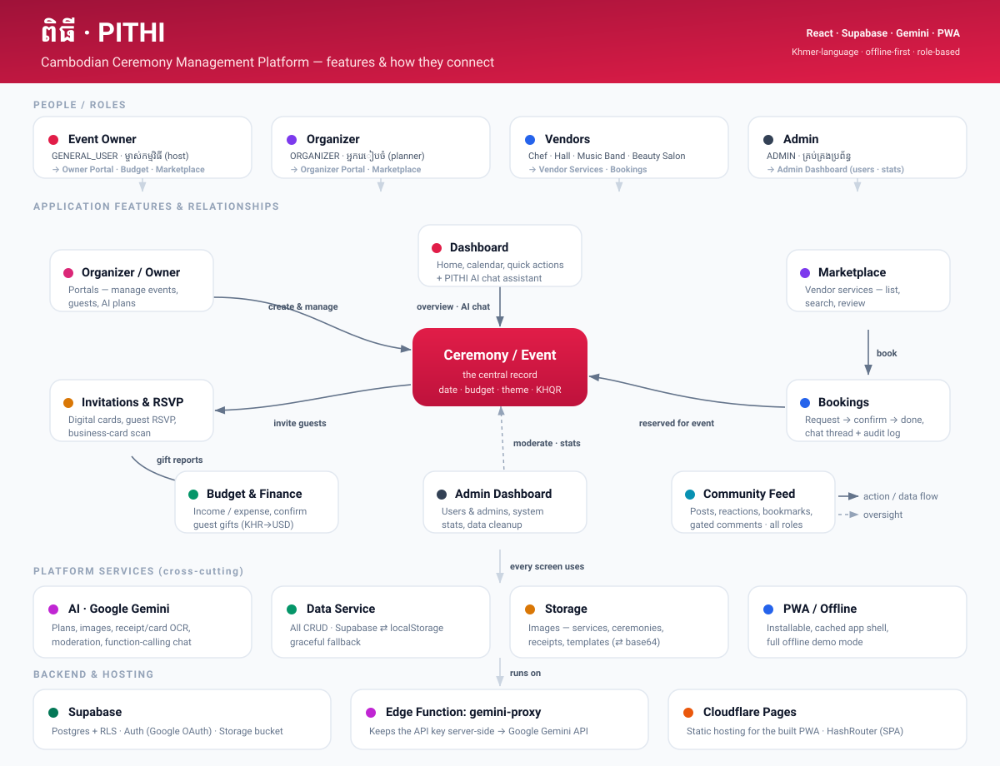

# អំពីយើង · About PITHI

**The team, partners, and incubator behind PITHI.**

---

## អំពីគម្រោង · About the project

PITHI ("ceremony" in Khmer) is a Progressive Web App for planning and managing
traditional Cambodian ceremonies - weddings, birthdays, housewarmings, funerals,
and memorial rites. It connects the people who host and organize events with the
vendors who service them, in a single Khmer-language marketplace.

PITHI is a **community project**. It is **free for everyone to use - we never
charge users**. Instead, the project sustains itself through voluntary support,
donations, and training, never through user fees.

PITHI is **incubated by CamboVerse, at the National University of Management
(NUM)**, Cambodia.

| | |
| --- | --- |
| 🎯 **បេសកកម្ម · Mission** | Make planning Khmer ceremonies simple, transparent, and accessible to everyone. |
| 🤝 **សហគមន៍ · Community** | Connect hosts, organizers, and vendors in one trusted network. |
| ✨ **បច្ចេកវិទ្យា · Technology** | Use AI and modern tooling to simplify everything from invitations to budgets. |

---

## 👥 ក្រុមការងារ · Meet the Team

The people who build and maintain PITHI.

<table>
  <!-- ROW 1 -->
  <tr>
    <td align="center" width="33%">
       
      <b>Member 1 Name</b> 
      <i>Founder &amp; CEO</i> 
      <a href="https://github.com/username">GitHub</a> · <a href="https://linkedin.com/in/username">LinkedIn</a>
    </td>
    <td align="center" width="33%">
       
      <b>Member 2 Name</b> 
      <i>Co-Founder</i> 
      <a href="https://github.com/username">GitHub</a> · <a href="https://linkedin.com/in/username">LinkedIn</a>
    </td>
    <td align="center" width="33%">
       
      <b>Member 3 Name</b> 
      <i>Lead Developer</i> 
      <a href="https://github.com/username">GitHub</a> · <a href="https://linkedin.com/in/username">LinkedIn</a>
    </td>
  </tr>
  <!-- ROW 2 -->
  <tr>
    <td align="center">
       
      <b>Member 4 Name</b> 
      <i>Backend Developer</i> 
      <a href="https://github.com/username">GitHub</a> · <a href="https://linkedin.com/in/username">LinkedIn</a>
    </td>
    <td align="center">
       
      <b>Member 5 Name</b> 
      <i>UI/UX Designer</i> 
      <a href="https://github.com/username">GitHub</a> · <a href="https://linkedin.com/in/username">LinkedIn</a>
    </td>
    <td align="center">
       
      <b>Member 6 Name</b> 
      <i>Marketing &amp; Partnerships</i> 
      <a href="https://github.com/username">GitHub</a> · <a href="https://linkedin.com/in/username">LinkedIn</a>
    </td>
  </tr>
</table>

> **Adding a member:** copy a `<td>...</td>` block into a new `<tr>...</tr>` row
> (3 per row) and drop the photo in `public/team/` as `member-N.jpg`.

---

## 🤝 ដៃគូ · Our Partners

We are grateful for the support and collaboration of our partners.

<table>
  <tr>
    <td align="center" width="50%">
        
      <b>National University of Management</b> 
      <i>Academic partner</i> 
      <a href="https://numuniversity.com/">numuniversity.com</a>
    </td>
    <td align="center" width="50%">
        
      <b>e-Khmer</b> 
      <i>Technology partner</i> 
      <a href="https://www.e-khmer.com/en">e-khmer.com</a>
    </td>
  </tr>
</table>

---

## 🚀 បណ្តុះបណ្តាលដោយ · Incubated By

  

  **CamboVerse** - Cambodia Metaverse 
  <i>PITHI is incubated and supported by CamboVerse at the National University of Management.</i> 
  <a href="https://camboverse.world/">camboverse.world</a>

---

## 🌐 ទំនាក់ទំនង · Connect with PITHI

Stay up to date with our project and community.

| | |
| --- | --- |
| 🌍 **Website** | [pithi.camboverse.world](https://pithi.camboverse.world) |
| 💬 **Telegram** | [Join our channel](https://t.me/+DBOU-zZhP_lkNTg9) |
| 🚀 **Incubator** | [camboverse.world](https://camboverse.world/) |
| 🎓 **University** | [numuniversity.com](https://numuniversity.com/) |
| 📧 **Email** | [contact@camboverse.world](mailto:contact@camboverse.world) |

---

© 2026 PITHI Platform · Incubated by CamboVerse · Licensed under Apache-2.0

